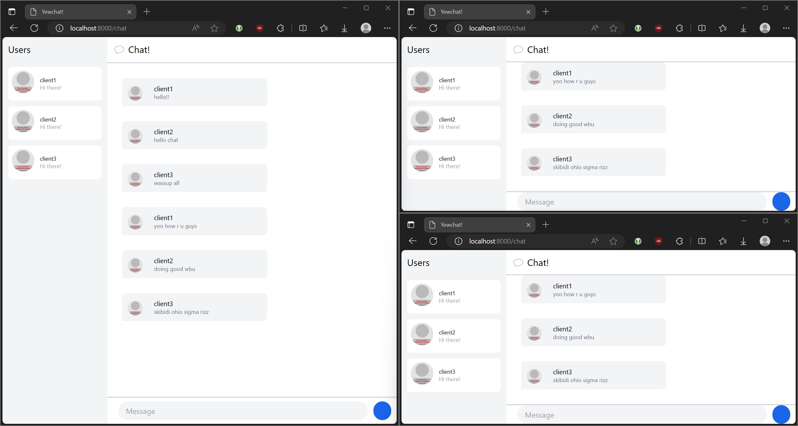

# Tutorial 10 - Part 3: WebChat using yew

## 3.1 Original code

Trying out YewChat with 3 clients connected at once:  

## 3.2 Add some creativities to the webclient

I modified the login page to support both light and dark mode  (+ different button text)  

I also overhauled and added light and dark mode support to the chat page so it looks more to my taste. Changes include:

- Changed "Users" text to "People", changed the font weight, size, and text position
- Changed "💬 Chat!" text to "#general", changed the position and font weight
- Changed the users/people list item design. "Hi there!" text now displays "Online"
- Changed avatars to use Dicebear's Indeticon avatars
- Changed the chat bubbles design. Message sender's avatar is now outside of the bubble, username is now in bold and smaller, and the message text is now bigger
- Changed the message bar design. It now has the same background color as the users/people sidebar, input field now uses more of the available space, and both the input and send button now has smaller corner radius
- Various text and background color changes

Here's a screenshot of a session with 3 connected clients in both light and dark mode:  

